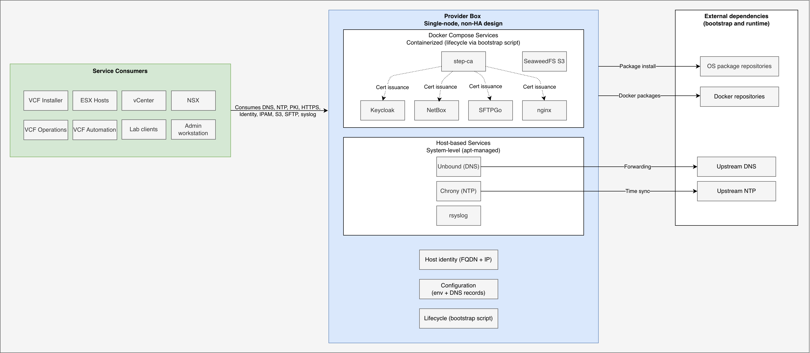

# Provider Box

Provider Box is a lightweight, single-node bootstrap framework for standing up shared infrastructure services on a single dedicated host. It provides a self-contained infrastructure services layer for lab environments.

It is designed for lab and proof-of-concept environments, especially VMware Cloud Foundation (VCF). It includes bootstrap support for:

- Unbound for DNS
- Chrony for NTP
- rsyslog for centralized syslog collection
- step-ca for a lightweight private certificate authority
- VCF offline depot served by nginx
- Keycloak for identity
- NetBox for IPAM, DCIM, and infrastructure source-of-truth
- SeaweedFS for S3-compatible object storage
- SFTPGo for SFTP file transfer

The repository is intentionally simple: copy the example configuration, update values for your environment, and run the bootstrap script for the services you need.

`bootstrap/provider-box.sh` is the entrypoint. It loads service-specific modules from `bootstrap/dns.sh`, `bootstrap/ntp.sh`, `bootstrap/rsyslog.sh`, `bootstrap/ca.sh`, `bootstrap/depot.sh`, `bootstrap/keycloak.sh`, `bootstrap/netbox.sh`, `bootstrap/s3.sh`, and `bootstrap/sftp.sh`.

## Overview


*Provider Box architecture showing host-based services, containerized services, and external dependencies.*

## Table of Contents

- [Quick Start](#quick-start)
- [Host Assumptions](#host-assumptions)
- [Choosing Services](#choosing-services)
- [Service Runtime Model](#service-runtime-model)
- [Removing Services](#removing-services)
- [Configuration Model](#configuration-model)
- [Dependency Updates](#dependency-updates)
- [Service Notes](#service-notes)
- [VCF Lab Companion](#vcf-lab-companion)
- [Design Trade-offs](#design-trade-offs)
- [Repository Layout](#repository-layout)
- [Development Safeguards](#development-safeguards)
- [Failure Handling](#failure-handling)
- [Operational Notes](#operational-notes)
- [Scope](#scope)

## Quick Start

### 1. Copy the example files

```bash
cp config/provider-box.env.example config/provider-box.env
cp config/unbound.records.example config/unbound.records
```

### 2. Update configuration files

- `config/provider-box.env` defines all service configuration
- `config/unbound.records` defines external and custom DNS records only

Built-in Provider Box service FQDNs are generated automatically from values in `provider-box.env`. You do not add built-in service records to `config/unbound.records`.

### Quick Password Setup

To quickly replace all placeholder passwords with a single value:

```bash
PASSWORD='VMware1!VMware1!' \
SECRET_KEY=$(openssl rand -base64 48 | sed 's/[&]/\\&/g') \
&& sed -i \
  -e "s|CHANGE_ME_WITH_AT_LEAST_50_RANDOM_CHARACTERS_BEFORE_USE|$SECRET_KEY|g" \
  -e "s|CHANGE_ME|$PASSWORD|g" \
  config/provider-box.env
```

### 3. Run the bootstrap script

Run only the services you want, or use `--all` to deploy all services in the correct order:

```bash
sudo bash bootstrap/provider-box.sh --unbound
sudo bash bootstrap/provider-box.sh --ntp
sudo bash bootstrap/provider-box.sh --rsyslog
sudo bash bootstrap/provider-box.sh --ca
sudo bash bootstrap/provider-box.sh --depot
sudo bash bootstrap/provider-box.sh --keycloak
sudo bash bootstrap/provider-box.sh --netbox
sudo bash bootstrap/provider-box.sh --s3
sudo bash bootstrap/provider-box.sh --sftp
sudo bash bootstrap/provider-box.sh --all
```

## Host Assumptions

Provider Box assumes:

- Ubuntu or Debian-based host (Provider Box is developed and tested on Debian GNU/Linux 13 (trixie), but should work on recent Ubuntu releases)
- root or `sudo` access
- static IP and prefix already configured on the host
- network connectivity from lab consumers to this host
- access to Debian or Ubuntu package repositories (required packages are installed automatically)
- access to Docker package repositories (required for containerized services)

Provider Box uses Docker Compose via `docker compose`. On Debian GNU/Linux 13, the `docker-compose` package provides this functionality.

## Choosing Services

### Minimum required for VCF bring-up

- Unbound for DNS
- Chrony for NTP

### Recommended for realistic lab environments

- rsyslog
- SFTPGo for file transfer
- step-ca
- VCF offline depot
- Keycloak
- NetBox

### Optional depending on use case

- SeaweedFS for S3-compatible storage

Services are intended to remain independently deployable unless a dependency is explicit and documented.

Examples:

- `--unbound` does not require NetBox
- `--netbox` does not require Unbound
- `--s3` and `--sftp` do not require unrelated service configuration
- step-ca is an intentional dependency for services that use Provider Box-issued TLS certificates

## Service Runtime Model

Provider Box uses a mixed runtime model. Host-based services modify the local system and are not managed via `--remove` (they must be removed manually using system package/service management), while Docker-based services are isolated and can be removed using `--remove`.

| Service   | Runtime |
|-----------|---------|
| Unbound  | Host (native service) |
| Chrony   | Host (native service) |
| rsyslog  | Host (native service) |
| step-ca  | Docker Compose |
| VCF offline depot | Docker Compose |
| Keycloak | Docker Compose |
| NetBox   | Docker Compose |
| SeaweedFS (S3) | Docker Compose |
| SFTPGo   | Docker Compose |

## Removing Services

Docker-based services can be removed with `--remove`:

```bash
sudo bash bootstrap/provider-box.sh --netbox --remove
sudo bash bootstrap/provider-box.sh --depot --remove
sudo bash bootstrap/provider-box.sh --sftp --remove
sudo bash bootstrap/provider-box.sh --all --remove
```

Removal stops and removes containers with `docker compose down` and deletes generated runtime files under `WORKDIR`. Persistent data directories are preserved. The remove path is idempotent and safe to run multiple times.

When using `--all --remove`, services are removed in reverse dependency order.

## Configuration Model

`config/provider-box.env` defines all service configuration.

Validation is strict and runs per selected service before deployment changes are made.

Pinned container image versions for Docker-based services are also defined centrally in `config/provider-box.env`.

For step-ca, no repository-shipped password file is required. Provider Box uses `CA_PASSWORD_FILE` when the file exists, materializes `CA_PASSWORD` into a managed `0600` file when set, or generates a random password automatically under `CA_DATA_DIR` when neither input is provided.

### General validation behavior

Provider Box rejects:

- empty required values
- invalid FQDNs
- invalid IPs or CIDRs
- invalid absolute-path requirements
- placeholder secret values such as `CHANGE_ME`
- malformed DNS record entries

### Host IP and canonical identity

`HOST_IP` uses IPv4 CIDR notation, for example:

```bash
HOST_IP="192.168.12.121/24"
```

Provider Box derives the raw host IPv4 address when services need a plain address and preserves the subnet information when it is useful for NetBox IPAM import.

`PROVIDER_BOX_FQDN` defines the canonical host identity for the Provider Box node.

This distinction is intentional:

- `PROVIDER_BOX_FQDN` is the canonical host FQDN for the shared Provider Box host IP
- service FQDNs such as `DNS_FQDN`, `CA_FQDN`, `DEPOT_FQDN`, `KEYCLOAK_FQDN`, `NETBOX_FQDN`, `S3_FQDN`, `SFTP_FQDN`, and `SYSLOG_FQDN` remain service endpoints on the same host

### DNS record format

`config/unbound.records` supports:

```text
<fqdn> <ip>
<fqdn> <ip/cidr>
```

Behavior:

- If a record includes CIDR information, Provider Box can derive the surrounding subnet for NetBox
- If a record includes only a plain IP, Provider Box imports the host address without guessing the subnet
- Built-in Provider Box service records are generated automatically and should not be duplicated in `config/unbound.records`

### Template rendering

Environment variables are exported before template rendering so `envsubst` can populate the service templates consistently.

## Dependency Updates

Container image versions are centrally defined in `config/provider-box.env.example` and kept up to date using Renovate in the Provider Box repository.

Users consume updated versions by pulling changes to the repository.

## Service Notes

### Unbound

- Acts as the authoritative DNS server for the lab domain
- Serves the configured domain as a static local zone
- Generates built-in Provider Box service records automatically
- Includes `PROVIDER_BOX_FQDN` as the canonical host record for the Provider Box node
- Uses `PROVIDER_BOX_FQDN` as the reverse PTR target for the Provider Box host IP
- Uses `config/unbound.records` only for external and custom records
- Uses the configured upstream forwarder for external resolution

Record format:

```text
<fqdn> <ip>
<fqdn> <ip/cidr>
```

If a record includes CIDR information, Provider Box can derive the surrounding subnet for NetBox, create the prefix object, and import the IP address object with the same mask. If a record uses only a plain IP, Provider Box imports the host address as `/32` without guessing a prefix.

### Chrony

- Uses configured upstream NTP servers
- Provides NTP service to internal networks

### rsyslog

- Runs natively on the host
- Exposes centralized syslog via UDP and TCP
- Intended for log aggregation, not long-term analytics
- Stores logs under `SYSLOG_LOG_DIR`

### step-ca

- Runs as a single-node Smallstep CA via Docker Compose
- Acts as the internal PKI for Provider Box services
- Exposed at `https://<CA_FQDN>:<CA_PORT>`
- Persists data under `CA_DATA_DIR`
- Allows service certificates up to `SERVICE_CERT_DURATION` (`8760h` by default)

Behavior:

- Initializes automatically on first start
- Uses `CA_PASSWORD_FILE` as-is when that file already exists
- Materializes `CA_PASSWORD` to a managed `0600` file when provided
- Generates a random CA password automatically when no password input is provided
- Running `--ca` configures the provisioner default and maximum X.509 certificate duration from `SERVICE_CERT_DURATION`

Important notes:

- `CA_PASSWORD` is convenient for lab use, but when set in `provider-box.env` it is still stored there in plaintext.
- Reinitialization requires deleting the contents of `CA_DATA_DIR`
- No repository-shipped static CA password file is required
- The root certificate is available from `/roots.pem`

### VCF offline depot

- Runs as a single-node nginx container via Docker Compose
- Requires step-ca to be initialized first
- Exposes:
  - HTTP over `http://<DEPOT_FQDN>:<DEPOT_HTTP_PORT>`
  - HTTPS over `https://<DEPOT_FQDN>:<DEPOT_HTTPS_PORT>`
- Uses a step-ca-issued certificate stored under `DEPOT_CERT_DIR`
- Stores the managed `htpasswd` file under `DEPOT_AUTH_DIR`
- Persists depot content under `DEPOT_DATA_DIR`
- Creates the expected `PROD/COMP`, `PROD/metadata`, and `PROD/vsan/hcl` directory layout during bootstrap
- Serves both HTTP and HTTPS directly in phase 1 with no forced redirect
- Protects `/PROD/metadata/`, `/PROD/COMP/`, and `/PROD/COMP/Compatibility/VxrailCompatibilityData.json` with basic auth
- Leaves `/PROD/vsan/hcl/` and `/healthz` accessible without authentication
- Renders runtime files under `WORKDIR/depot`

Removal behavior:

- `--depot --remove` runs `docker compose down`
- Generated runtime files under `WORKDIR/depot` are removed
- The managed `htpasswd` file is removed and recreated on the next bootstrap run
- Persistent depot content under `DEPOT_DATA_DIR` is preserved
- step-ca-issued certificates under `DEPOT_CERT_DIR` are preserved

### Keycloak

- Runs via Docker Compose
- Requires step-ca to be initialized first
- Uses a certificate issued by step-ca
- Exposed at `https://<KEYCLOAK_FQDN>:<KEYCLOAK_PORT>` (`8443` by default)
- Seeds an opinionated initial realm from a repository-managed realm import template on first deployment

Key files:

- `keycloak.crt` for the Keycloak HTTPS certificate file
- `keycloak.key` for the private key
- `keycloak-ca-chain.pem` for CA chain material
- `keycloak-ca-roots.pem` for roots-only trust use cases
- `keycloak-full-chain.pem` for VCF SSO certificate-chain upload

VCF SSO expects the full IdP TLS chain in leaf, intermediate, root order. Use `keycloak-full-chain.pem` for that upload field.

Realm bootstrap:

- Uses a repository-managed realm template derived from a working Keycloak realm export and adapted for Provider Box
- Imports one opinionated initial realm, one bootstrap group, and one baseline OIDC client for VCF-style integration
- Bootstraps one initial lab user in the bootstrap realm using `KEYCLOAK_BOOTSTRAP_USERNAME`, `KEYCLOAK_BOOTSTRAP_USER_PASSWORD`, and `KEYCLOAK_BOOTSTRAP_USER_EMAIL_DOMAIN`
- Seeds initial realm state only; it does not provide a generic realm-management framework
- Changes to the realm template are only applied on initial bootstrap; existing realms are not reconciled or modified on subsequent runs

### NetBox

- Runs via Docker Compose with NetBox, PostgreSQL, Redis, and a small HTTPS terminator
- Requires step-ca to be initialized first
- Intended as an IPAM, DCIM, and infrastructure source-of-truth service
- Exposed at `https://<NETBOX_FQDN>:<NETBOX_PORT>`
- Persists media under `NETBOX_MEDIA_DIR`
- Persists PostgreSQL data under `NETBOX_POSTGRES_DATA_DIR`
- Persists Redis data under `NETBOX_REDIS_DATA_DIR`
- Uses a step-ca-issued certificate stored under `${NETBOX_DIR}/certs`
- Bootstraps the initial superuser from `NETBOX_SUPERUSER_*` variables on first start
- Seeds Provider Box service endpoints into NetBox via the NetBox API after startup
- Imports DNS records from `config/unbound.records` into NetBox via the API

IPAM behavior:

- `PROVIDER_BOX_FQDN` is used as the canonical `dns_name` for the shared Provider Box host IP object
- Built-in Provider Box service FQDNs are stored in that canonical host IP object description
- Built-in service FQDNs remain service endpoints on the same host
- The canonical Provider Box host IP object is created explicitly from `HOST_IP` and `PROVIDER_BOX_FQDN`, not from DNS record imports
- Prefix objects are created when CIDR information is available
- IP address objects use the actual configured mask when CIDR is known, for example `192.168.12.121/24`
- `/32` is used only when subnet information is not available
- One NetBox IP address object is created per unique address value
- Built-in Provider Box service FQDNs share the canonical host IP object instead of creating duplicates

This canonical host-IP model is NetBox seeding behavior only. It does not require Unbound to be deployed.

### SeaweedFS S3

- Single-node S3-compatible object storage
- Exposed at `http://<S3_FQDN>:<S3_PORT>` (no TLS by default)
- Data persisted under `S3_DATA_DIR`

### SFTPGo

- Single-node SFTP service via Docker Compose
- Requires step-ca to be initialized first for the HTTPS admin UI certificate
- Exposes:
  - SFTP endpoint
  - Client UI over `https://<SFTP_FQDN>:<SFTP_ADMIN_PORT>/web/client/login`
  - Admin UI over `https://<SFTP_FQDN>:<SFTP_ADMIN_PORT>/web/admin/login`
- Uses a step-ca-issued certificate for the HTTPS admin UI
- Stores the SFTPGo UI certificate under `SFTP_CERT_DIR`
- Bootstraps the initial admin UI user from `SFTP_ADMIN_USER` and `SFTP_ADMIN_PASSWORD`
- Default admin bootstrap applies only when no SFTPGo admin user already exists
- Optionally creates one backup user when `SFTP_BACKUP_USERNAME`, `SFTP_BACKUP_PASSWORD`, and `SFTP_BACKUP_HOME_DIR` are all set
- Existing backup users are left unchanged on later bootstrap runs

The SFTP protocol service remains separate from the HTTPS UI configuration.

## VCF Lab Companion

Provider Box provides a lightweight external infrastructure services platform for VMware Cloud Foundation lab and PoC environments.

VCF depends on external services that are not provided by the platform itself.

### Pre-deployment requirements

- DNS for forward and reverse resolution
- NTP for time synchronization

### Post-deployment operational dependencies

- identity provider for OIDC or federation
- centralized logging
- certificate authority
- optional object storage and file transfer services

Provider Box packages these services into a single reproducible node so VCF labs can be built without depending on external enterprise infrastructure.

This is especially useful in isolated, homelab, and lab environments where the supporting service plane must be self-contained.

## Design Trade-offs

Provider Box is intentionally single-node and not highly available.

It prioritizes:

- simplicity
- reproducibility
- low resource footprint

Over:

- redundancy
- production-grade resilience
- orchestration complexity

It is opinionated for labs and PoCs, not for HA production deployment patterns.

## Repository Layout

```text
bootstrap/
  ca.sh
  depot.sh
  dns.sh
  keycloak.sh
  netbox.sh
  ntp.sh
  provider-box.sh
  rsyslog.sh
  s3.sh
  sftp.sh

config/
  provider-box.env.example
  unbound.records.example

templates/
  unbound.conf.tpl
  chrony.conf.tpl
  rsyslog.conf.tpl
  docker-compose.step-ca.yml.tpl
  docker-compose.depot.yml.tpl
  docker-compose.keycloak.yml.tpl
  docker-compose.netbox.yml.tpl
  docker-compose.s3.yml.tpl
  docker-compose.sftpgo.yml.tpl
  depot-nginx.conf.tpl
  netbox-nginx.conf.tpl
```

## Development Safeguards

This repository can optionally be used with local `pre-commit` hooks to catch hygiene issues and prevent accidentally committing secrets.

Install:

```bash
pipx install pre-commit
pre-commit install
```

Run manually:

```bash
pre-commit run --all-files
```

The configured Gitleaks hook scans for secrets before commits are created.

## Failure Handling

The bootstrap process fails fast if:

- required files are missing
- package installation fails
- required commands are unavailable
- validation fails
- configuration is malformed

This keeps deployments predictable and reproducible.

## Operational Notes

- Use FQDNs instead of raw IPs where possible
- Ensure both forward and reverse DNS are configured
- Import `keycloak-ca-chain.pem` into VCF when configuring OIDC
- Use `keycloak-ca-roots.pem` only when a roots-only trust bundle is required
- Built-in Provider Box service DNS records are generated automatically; reserve `config/unbound.records` for external and custom records

### DNS behavior warning

`configure_resolv_conf()` rewrites `/etc/resolv.conf` and disables `systemd-resolved`.

This changes local DNS resolution behavior on the host.

## Scope

Provider Box focuses on a simple, modular, and reproducible way to deploy shared infrastructure services on a single host for lab and PoC environments.

It is intentionally:

- shell-based
- template-driven
- explicit
- single-node
- easy to reason about

It does not aim to introduce orchestration layers, HA patterns, or broad production abstractions.
